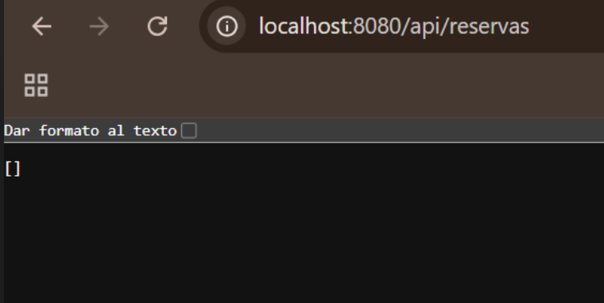

# Sistema de Reserva de Laboratorios - API REST & Vista MVC

## Descripción
Repositorio del post-contenido de la Unidad 5 de Patrones de Diseño de Software. Se desarrolló un único proyecto Spring Boot (`reservas-labs-api`) para la gestión y reserva de laboratorios de cómputo, estructurado en dos superficies de presentación:
1. **Parte 1 (API REST):** Arquitectura en capas (`model`, `repository`, `service`, `exception`, `controller`) sobre base de datos H2.
2. **Parte 2 (Vista MVC):** Interfaz web con Thymeleaf (`web`, `templates`) que reutiliza de forma directa la misma capa de servicio.

---

## Parte 1 — Repository, Service y Controller REST
* `LaboratorioRepository` y `ReservaRepository` extienden `JpaRepository`.
* `ReservaRepository` agrega una consulta JPQL personalizada (`buscarSolapamientos`) para detectar solapamientos de horario en base de datos.
* `ReservaService` concentra todas las reglas de negocio (validación de solapamientos, horario de atención de 07:00 a 21:00, duración entre 30m y 3h, y cancelación).
* `ReservaController` y `LaboratorioController` exponen los endpoints `/api/reservas` y `/api/laboratorios`.

Ver paquetes: `com.universidad.reservaslabs.model`, `repository`, `service`, `exception` y `controller`.

---

## Parte 2 — Vista MVC con Thymeleaf
* `ReservaWebController` expone las rutas `/reservas` y `/reservas/nueva` para la interfaz web.
* Inyecta exactamente la **MISMA instancia** de `ReservaService` que utiliza la API REST, garantizando cero duplicación de lógica de negocio.
* `ReservaWebExceptionHandler` captura las excepciones de dominio (`ReservaConflictException`, `RecursoNoEncontradoException`) y realiza redirecciones HTML mostrando mensajes flash legibles para el usuario.

Ver paquetes: `com.universidad.reservaslabs.web` y plantillas en `src/main/resources/templates/reservas/`.

---

## Cómo Ejecutar el Proyecto

```bash
# Compilar y empaquetar el proyecto
$ ./mvnw clean package

# Ejecutar la aplicación Spring Boot
$ ./mvnw spring-boot:run
API REST: http://localhost:8080/api/reservas

Vista Web MVC: http://localhost:8080/reservas
```

## Decisiones de Diseño
## Punto de Decisión 1: Validaciones de Solapamiento
El filtro de solapamientos se delega a la base de datos mediante la consulta JPQL en `ReservaRepository.buscarSolapamientos()`. Esto evita cargar todas las reservas en memoria RAM (lo cual no escalaría bien a largo plazo). Sin embargo, la decisión de negocio y el lanzamiento de la excepción `ReservaConflictException` la gestiona exclusivamente `ReservaService`.

## ¿Qué pasaría si el Controller llamara directamente al Repository?

Si el controlador usara la consulta directamente, la lógica de validación de negocio quedaría expuesta en la capa HTTP, rompiendo la arquitectura en capas y duplicando código si se añaden otros clientes o controladores.

## Punto de Decisión 2: Separación de Reglas de Negocio y Justificación de Arquitectura
**Reglas con acceso a datos:** Como la comprobación de cruces de horario, se apoyan en consultas específicas de ReservaRepository.

**Reglas puras del dominio:** La validación de horario de atención (07:00 a 21:00) y la duración permitida (30 min a 3 horas) residen 100% en `ReservaService` utilizando Java puro, ya que solo dependen de los datos de la solicitud y no requieren consultar la base de datos.

**Justificación de Arquitectura en Controladores:** `LaboratorioController` accede directamente a `LaboratorioRepository` sin pasar por un `Service` debido a que el catálogo de laboratorios es un CRUD básico sin reglas de negocio adicionales. Crear un LaboratorioService en este contexto generaría el antipatrón de Service anémico. En cambio, `ReservaController` delega siempre sus peticiones a `ReservaService`, donde se aplican las reglas de negocio e invalidez de solapamientos.

## Punto de Decisión 3: Cómo comparten Service el Controller MVC y el REST
Tanto `ReservaController` (API REST) como   `ReservaWebController` (MVC con Thymeleaf) inyectan exactamente el mismo bean de `ReservaService` mediante inyección por constructor. Se descarta la duplicación de validaciones o la creación de un servicio específico para la web para evitar discrepancias en las reglas de negocio (solapamiento y horario) ante futuros cambios.

## Punto de Decisión 4: Manejo de Errores Consistente entre MVC y REST
No se utilizaron los errores de `ReservaWebController` dentro de un único `@RestControllerAdvice` global porque este serializa siempre a JSON, mientras que la vista Thymeleaf requiere una redirección con un mensaje en HTML. La alternativa de detectar el encabezado Accept añadía condicionales innecesarios. Se optó por dos manejadores separados:

**GlobalRestExceptionHandler (restringido a @RestController).**

**ReservaWebExceptionHandler (restringido con assignableTypes = ReservaWebController.class).**

Ambos manejadores parten del mismo vocabulario de excepciones de dominio, manteniendo la separación de responsabilidades según la superficie de presentación.

## Evidencia de Funcionamiento (Capturas)

### Vista Web MVC (Thymeleaf)


### API REST (Postman / cURL)


## Herramientas Utilizadas
Lenguaje & Framework: Java 17, Spring Boot 3.2.x

Persistencia: Spring Data JPA, Hibernate, H2 Database (In-Memory)

Vista: Thymeleaf, HTML5

Construcción & Control de Versiones: Apache Maven, Git, GitHub

## Conclusiones
El desarrollo de esta aplicación demostró cómo una arquitectura adecuadamente desacoplada permite exponer múltiples interfaces de usuario (API REST y MVC con Thymeleaf) reutilizando una única capa de servicios sin duplicar reglas de dominio. La definición precisa de responsabilidades permitió delegar consultas complejas de tiempo a la base de datos manteniendo la decisión de negocio centralizada en la capa Service. Finalmente, la segregación de manejadores de excepciones garantizó respuestas coherentes para clientes programáticos en JSON y redirecciones informativas en HTML para usuarios web.