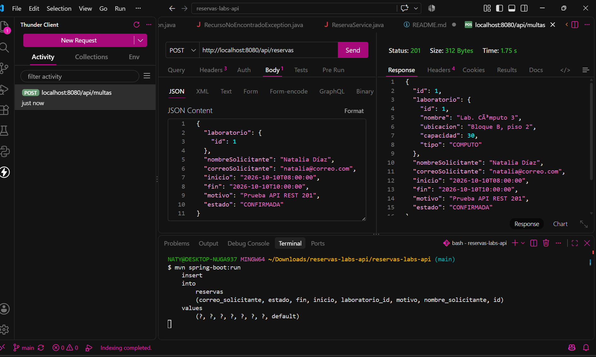
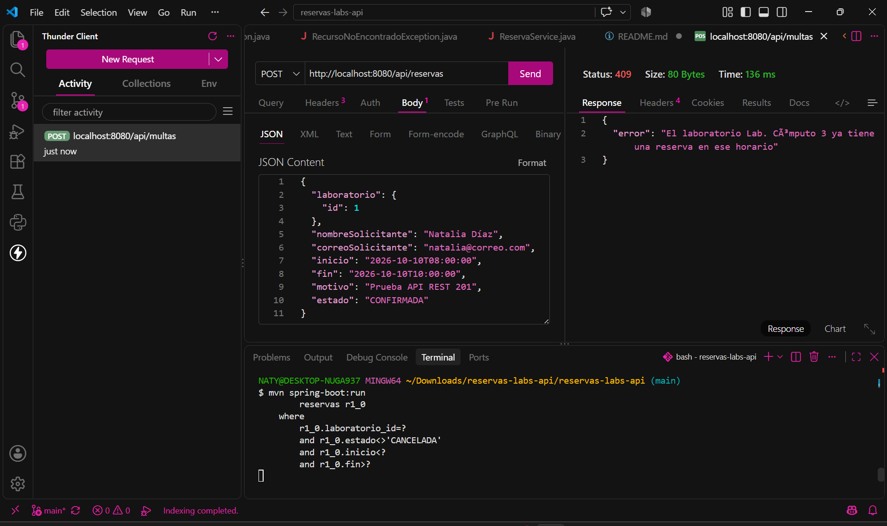
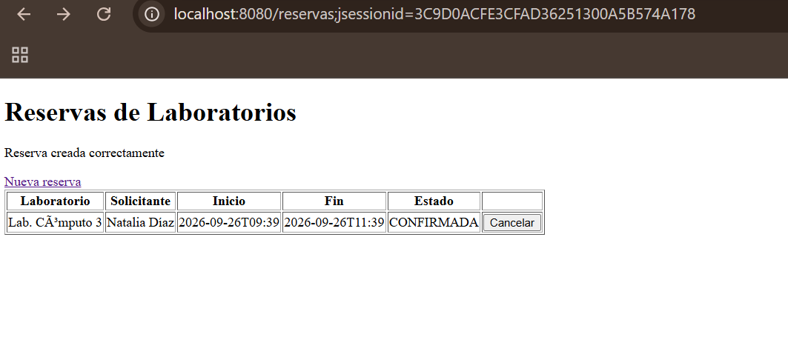
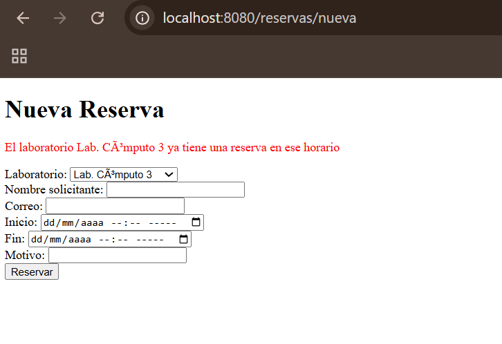

# Sistema de Reserva de Laboratorios - API REST & Vista MVC

## Descripción
Repositorio del post-contenido de la Unidad 5 de Patrones de Diseño de Software. Se desarrolló un único proyecto Spring Boot (`reservas-labs-api`) para la gestión y reserva de laboratorios de cómputo, estructurado en dos superficies de presentación:
1. **Parte 1 (API REST):** Arquitectura en capas (`model`, `repository`, `service`, `exception`, `controller`) sobre base de datos H2.
2. **Parte 2 (Vista MVC):** Interfaz web con Thymeleaf (`web`, `templates`) que reutiliza de forma directa la misma capa de servicio.

---

## Parte 1 — Repository, Service y Controller REST
* `LaboratorioRepository` y `ReservaRepository` extienden `JpaRepository`.
* `ReservaRepository` agrega una consulta JPQL personalizada (`buscarSolapamientos`) para detectar solapamientos de horario en base de datos.
* `ReservaService` concentra todas las reglas de negocio (validación de solapamientos, horario de atención de 07:00 a 21:00, duración entre 30m y 3h, y cancelación).
* `ReservaController` y `LaboratorioController` exponen los endpoints `/api/reservas` y `/api/laboratorios`.

Ver paquetes: `com.universidad.reservaslabs.model`, `repository`, `service`, `exception` y `controller`.

---

## Parte 2 — Vista MVC con Thymeleaf
* `ReservaWebController` expone las rutas `/reservas` y `/reservas/nueva` para la interfaz web.
* Inyecta exactamente la **MISMA instancia** de `ReservaService` que utiliza la API REST, garantizando cero duplicación de lógica de negocio.
* `ReservaWebExceptionHandler` captura las excepciones de dominio (`ReservaConflictException`, `RecursoNoEncontradoException`) y realiza redirecciones HTML mostrando mensajes flash legibles para el usuario.

Ver paquetes: `com.universidad.reservaslabs.web` y plantillas en `src/main/resources/templates/reservas/`.

---

## Cómo Ejecutar el Proyecto

```bash
# Compilar y empaquetar el proyecto
$ ./mvnw clean package

# Ejecutar la aplicación Spring Boot
$ ./mvnw spring-boot:run
API REST: http://localhost:8080/api/reservas

Vista Web MVC: http://localhost:8080/reservas
```

## Decisiones de diseño

### Punto de decisión 1: Ubicación de la validación de solapamiento
El filtrado de solapamientos se delegó al `ReservaRepository` mediante una consulta JPQL (`buscarSolapamientos`) porque realizar esta búsqueda en la base de datos es óptimo a nivel de memoria y rendimiento ($O(1)$ en transferencia de datos), evitando cargar todas las reservas a memoria en Java. Sin embargo, la decisión de negocio (qué hacer cuando hay un solapamiento, lanzar `ReservaConflictException` y definir el mensaje de error) vive exclusivamente en `ReservaService`. 
*Si el Controller llamara directamente a `buscarSolapamientos()`, se rompería la arquitectura en capas al forzar a la capa de presentación a manejar lógica de dominio y transformar los datos devueltos por el Repository.*

### Punto de decisión 2: Reglas con y sin apoyo del Repository
La validación del horario de atención (07:00 a 21:00) y la duración permitida (30 minutos a 3 horas) no requiere consultar la base de datos porque depende únicamente de los atributos del propio objeto `Reserva` enviado en la petición. Por lo tanto, vive en `ReservaService` ejecutada en memoria con Java puro. El criterio general aplicado es: si la regla requiere validar consistencia contra el estado global del sistema (otras reservas), se apoya en el `Repository`; si depende solo del estado del objeto de entrada, se valida directamente en el `Service`.

### Punto de decisión 3: Cómo comparten Service el Controller MVC y el REST
Tanto `ReservaController` (REST) como `ReservaWebController` (MVC) reciben por inyección de dependencias por constructor exactamente el mismo bean singleton `ReservaService`. Duplicar la lógica en un controlador o crear un `ReservaWebService` secundario habría violado el principio DRY (*Don't Repeat Yourself*), obligando a modificar dos archivos ante cualquier cambio en las reglas de negocio.

### Punto de decisión 4: Manejo de errores consistente entre MVC y REST
Se implementaron dos manejadores independientes: `GlobalRestExceptionHandler` (restringido con `annotations = RestController.class`) y `ReservaWebExceptionHandler` (restringido con `assignableTypes = ReservaWebController.class`). Un único `@RestControllerAdvice` no es adecuado porque serializa siempre las respuestas a formato JSON. La interfaz web MVC necesita una redirección (`redirect:/reservas/nueva`) adjuntando el mensaje mediante `FlashAttributes` para mostrar una alerta HTML al usuario, manteniendo la separación de responsabilidades según el canal de presentación.
## Evidencias de Funcionamiento

### 1. API REST (Controlador REST)
* **Creación exitosa de reserva (HTTP 201 Created):**
  

* **Manejo de conflicto por solapamiento (HTTP 409 Conflict):**
  

### 2. Interfaz Web (Controlador MVC con Thymeleaf)
* **Listado general de reservas habilitadas:**
  

* **Validación de solapamiento en formulario con mensaje de error:**
  

## Conclusiones
La implementación de este sistema permitió comprender la importancia de mantener una clara separación de responsabilidades mediante la arquitectura en capas. El principal reto consistió en identificar el límite exacto entre las consultas de datos del `Repository` y la toma de decisiones de negocio dentro del `Service`. La reutilización del `Service` entre la API REST y la vista MVC demostró las ventajas de centralizar la lógica de dominio, garantizando la consistencia de las reglas de negocio independientemente del canal de entrada.
