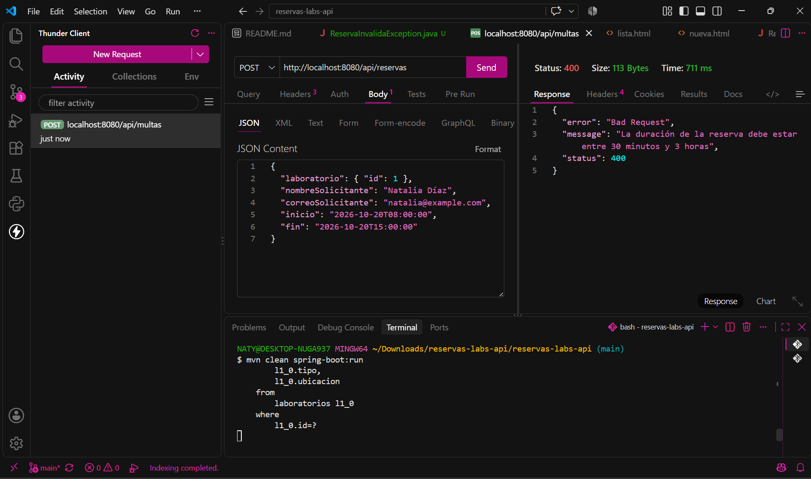
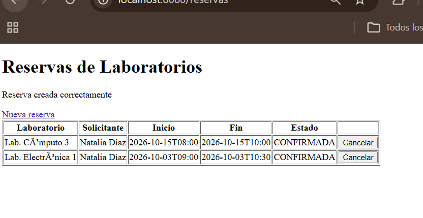
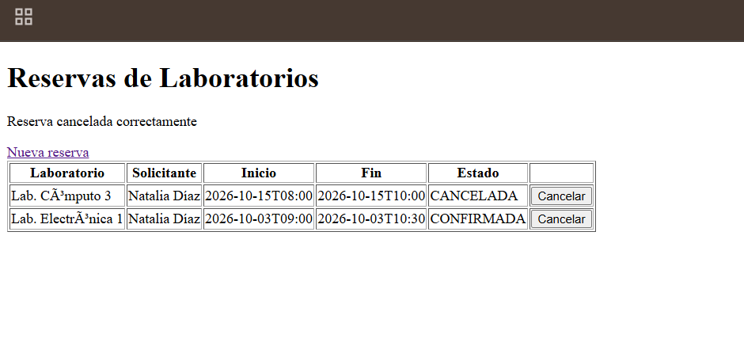

# Post-contenido — Unidad 5: Sistema de Reserva de Laboratorios (API REST & Vista MVC)

## Herramientas Utilizadas
* **Lenguaje:** Java 17
* **Framework:** Spring Boot 3.x (Spring Web, Spring Data JPA, Thymeleaf, Validation)
* **Base de Datos:** H2 Database (In-Memory)
* **Herramientas de Desarrollo & Pruebas:** VS Code, Maven, Thunder Client
* **Librerías Auxiliares:** Lombok

---

## Descripción General y Arquitectura en Capas

Este repositorio contiene la solución para el post-contenido de la Unidad 5 de Patrones de Diseño de Software (`reservas-labs-api`). El sistema gestiona la reserva de laboratorios de cómputo y electrónica mediante una **arquitectura en capas bien definida**:

1. **Capa de Dominio / Modelo (`model`):** Entidades JPA (`Laboratorio`, `Reserva`) y enums (`EstadoReserva`) que representan el modelo relacional.
2. **Capa de Acceso a Datos (`repository`):** Interfaces JPA (`LaboratorioRepository`, `ReservaRepository`) que abstraen la persistencia en la base de datos H2.
3. **Capa de Lógica de Negocio (`service`):** Centralizada en `ReservaService`, donde se ejecutan todas las reglas del sistema (horarios, duraciones, solapamientos y reglas de estado).
4. **Capa de Excepciones (`exception`):** Jerarquía de excepciones de dominio (`ReservaConflictException`, `ReservaInvalidaException`, `RecursoNoEncontradoException`) para desacoplar el manejo de errores.
5. **Capa de Presentación / Controladores (`controller` & `web`):**
   * **API REST (`controller`):** Controladores REST (`ReservaController`, `LaboratorioController`) que retornan respuestas JSON y códigos de estado HTTP estándar.
   * **Vista MVC (`web` & `templates`):** Controlador Web (`ReservaWebController`) y plantillas HTML con Thymeleaf para navegación en navegador.

---

## Tabla de Endpoints REST y Rutas MVC

### Endpoints API REST (`/api`)
| Método | Endpoint | Descripción | Respuesta |
| :--- | :--- | :--- | :--- |
| `GET` | `/api/laboratorios` | Lista todos los laboratorios registrados | `200 OK` (JSON) |
| `GET` | `/api/laboratorios/{id}` | Obtiene el detalle de un laboratorio por ID | `200 OK` / `404 Not Found` |
| `POST` | `/api/laboratorios` | Crea un nuevo laboratorio | `201 Created` (JSON) |
| `GET` | `/api/reservas` | Lista todas las reservas registradas (históricas y activas) | `200 OK` (JSON) |
| `GET` | `/api/reservas/{id}` | Obtiene el detalle de una reserva por ID | `200 OK` / `404 Not Found` |
| `GET` | `/api/reservas/laboratorio/{id}` | Lista todas las reservas de un laboratorio específico | `200 OK` (JSON) |
| `POST` | `/api/reservas` | Crea una nueva reserva realizando validaciones de negocio | `201 Created` / `400 Bad Request` / `409 Conflict` |
| `DELETE` | `/api/reservas/{id}` | Cancela/Anula una reserva existente por su ID | `204 No Content` / `404 Not Found` / `409 Conflict` |

### Rutas Interfaz Web MVC (`/reservas`)
| Método | Ruta | Descripción | Vista / Resultado |
| :--- | :--- | :--- | :--- |
| `GET` | `/reservas` | Muestra el listado web de reservas | `reservas/lista.html` |
| `GET` | `/reservas/nueva` | Muestra el formulario web para crear una reserva | `reservas/nueva.html` |
| `POST` | `/reservas` | Procesa el formulario web de reserva | Redirect a `/reservas` o reintento con mensaje Flash |
| `POST` | `/reservas/{id}/cancelar`| Procesa la cancelación de una reserva desde la web | Redirect a `/reservas` |

---

## Documentación de Controladores
* **`LaboratorioController`:** Expone los servicios de consulta y creación de laboratorios. **Nota sobre diseño:** A diferencia de las reservas, la gestión de laboratorios no requiere reglas de negocio complejas ni validaciones de estado, por lo cual este controlador interactúa directamente con `LaboratorioRepository` sin recargar la capa de servicios innecesariamente.
* **`ReservaController`:** Expone los endpoints REST consumidos por clientes API / Thunder Client.
* **`ReservaWebController`:** Gestiona el flujo de navegación de la interfaz web con Thymeleaf.

---

## Cómo Ejecutar el Proyecto

```bash
# Compilar y empaquetar el proyecto
./mvnw clean package

# Ejecutar la aplicación Spring Boot
./mvnw spring-boot:run
```

* **API REST:** <http://localhost:8080/api/reservas>
* **Vista Web MVC:** <http://localhost:8080/reservas>

## Decisiones de diseño

### Punto de decisión 1: Ubicación de la validación de solapamiento
El filtrado de solapamientos se delegó al `ReservaRepository` mediante una consulta JPQL personalizada (`buscarSolapamientos`). Filtrar las coincidencias directamente en el motor de base de datos es óptimo porque evita traer todo el historial de reservas a la memoria de la JVM para evaluarlo en Java. Sin embargo, la regla de negocio (qué hacer ante la coincidencia, lanzar `ReservaConflictException` y definir el mensaje) vive exclusivamente en `ReservaService`.

*Si el controlador llamara directamente al repositorio para validar la lógica de solapamiento, violaría la separación de capas asignando responsabilidades del dominio a la presentación.*

### Punto de decisión 2: Reglas con y sin apoyo del Repository
La validación del horario de atención (07:00 a 21:00) y la duración permitida (30 minutos a 3 horas) no requiere consultar la base de datos porque depende únicamente de los atributos de la petición de entrada. Por lo tanto, vive en `ReservaService` ejecutada en memoria con Java puro. El criterio aplicado es: si la regla requiere validar consistencia contra el estado global del sistema (otras reservas), se apoya en el `ReservaRepository`; si depende solo del objeto recibido, se valida en memoria dentro del `ReservaService`.

### Punto de decisión 3: Cómo comparten Service el Controller MVC y el REST
Tanto `ReservaController` (REST, inyección por constructor en la línea 18) como `ReservaWebController` (MVC, inyección por constructor en la línea 15) reciben mediante inyección de dependencias exactamente el mismo bean singleton `ReservaService`. Duplicar la lógica en los controladores o crear un servicio web duplicado habría violado el principio DRY (*Don't Repeat Yourself*), obligando a modificar múltiples clases ante cualquier cambio en el dominio.

### Punto de decisión 4: Manejo de errores consistente entre MVC y REST
Se implementaron dos manejadores independientes que comparten el **mismo vocabulario de excepciones de dominio** (`ReservaConflictException`, `ReservaInvalidaException`, `RecursoNoEncontradoException`): `GlobalRestExceptionHandler` (restringido a `@RestController`) y `ReservaWebExceptionHandler` (restringido a `ReservaWebController`).

* **Alternativa descartada:** Se descartó implementar un único `@RestControllerAdvice` global que inspeccionara la cabecera `Accept` de la petición HTTP. Dicha opción acoplaba en una sola clase la devolución de JSON estructurado con la lógica de presentación HTML (redirecciones `redirect:/reservas/nueva` y mensajes `RedirectAttributes`), violando el Principio de Responsabilidad Única (SRP). Un `@RestControllerAdvice` serializa siempre a JSON, mientras que la web necesita una redirección con un mensaje legible. La captura `error-solapamiento-web.png` muestra que un intento de reserva solapada produce el mismo mensaje de negocio que devuelve la API REST en JSON.egible. La captura error-solapamiento-web.png muestra que un intento de reserva solapada produce el mismo mensaje de negocio que devuelve la API REST en JSON.

## Evidencias de Funcionamiento

### 1. API REST (Controlador REST)
* **Creación exitosa de reserva (HTTP 201 Created):**
  

* **Manejo de conflicto por solapamiento (HTTP 409 Conflict):**
  

* **Validación de horario/duración inválida (HTTP 400 Bad Request):**
  

### 2. Interfaz Web (Controlador MVC con Thymeleaf)
* **Listado general de reservas habilitadas:**
  

* **Creación exitosa de reserva desde interfaz web:**
  

* **Validación de solapamiento en formulario con mensaje de error:**
  

* **Cancelación de reserva desde la interfaz web:**
  

## Conclusiones
La implementación de este sistema permitió comprender la importancia de mantener una clara separación de responsabilidades mediante la arquitectura en capas. El principal reto consistió en identificar el límite exacto entre las consultas de datos del `Repository` y la toma de decisiones de negocio dentro del `Service`. La reutilización del `Service` entre la API REST y la vista MVC demostró las ventajas de centralizar la lógica de dominio, garantizando la consistencia de las reglas de negocio independientemente del canal de entrada.
